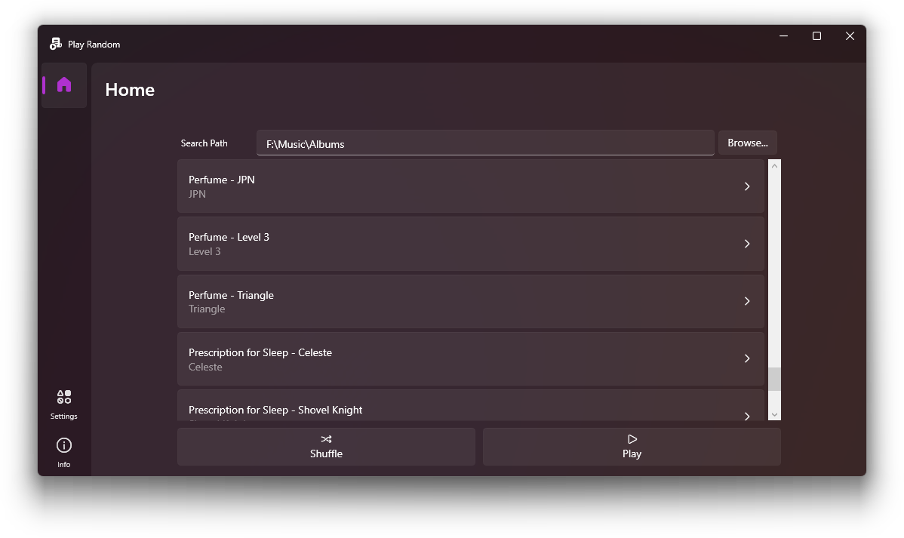
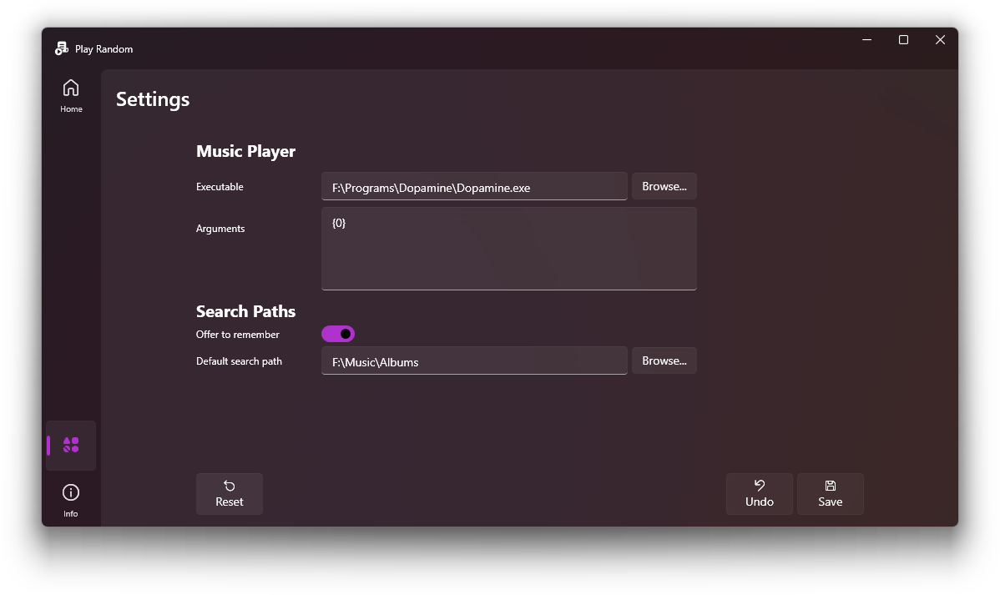
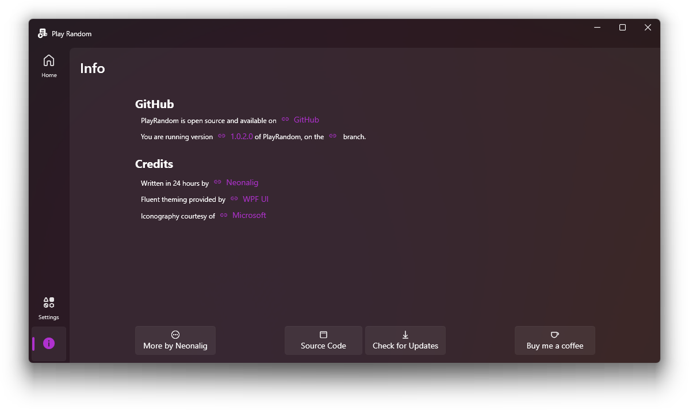

# PlayRandom

PlayRandom is a C# WPF application designed to shuffle through your music folders and playlists, allowing you to quickly pick a random set of songs to play. The primary focus of this app is speed, ensuring you get your music started in just under the number of fingers you have on one hand.

## Features

- **Fluent Design**: The application adheres to the Fluent design principles of Windows 11, providing a sleek and modern UI, courtesy of [lepo.co WPF UI](https://wpfui.lepo.co).
- **Shuffle Music**: Effortlessly shuffles your music folders and playlists.
- **Speedy Operation**: Designed with speed in mind, letting you start your music in less than the number of fingers you have on one hand.
- **Configurable Settings**: Users can configure the default search path with the option to 'remember search path'. Preferred music player and launch arguments can be configured.
- **Automated Github Update Checker**: The info page integrates an automated Github update checker using [Octokit](https://github.com/octokit/octokit.net), ensuring your app stays updated.

## Built With

- [.NET 8.0](https://dotnet.microsoft.com/en-us/download/dotnet/8.0) - Utilizing the latest C# features, including nullability annotations.
- [JetBrains Rider](https://www.jetbrains.com/rider/) - Preferred C# development environment, but it can also be developed using other C# IDEs.
- [PropertyChanged.Fody](https://github.com/Fody/PropertyChanged) - For automated INotifyPropertyChanged implementations.

## Getting Started

### Prerequisites

- [.NET 8.0](https://dotnet.microsoft.com/en-us/download/dotnet/8.0) or above. You can download it from the [official Microsoft website](https://dotnet.microsoft.com/download).

### Installation

1. Download the latest release from the [releases page](https://github.com/Neonalig/PlayRandom/releases).
2. Unzip the downloaded file.
3. Run the `PlayRandom.exe` to start the application.

Optionally, use the `build.ps1` script found in the root directory to build an executable specifically for your machine using dotnet publish (AOT compilation straight to machine code).

## Usage

1. After launching the application, navigate to the settings page.
2. Configure your default search path for your music folders and playlists, select your preferred music player, and specify any launch arguments.
3. Enable the 'Remember search path' toggle if you want the application to remember your search path for future sessions.
4. Once done, go back to the main page and press 'Shuffle' to have the app quickly choose a random set of songs for you.

## Updates

The application automatically checks for updates using Octokit. You can also manually download the latest version from the [releases page](https://github.com/Neonalig/PlayRandom/releases).

## Contributing

Contributions are welcome. If you'd like to contribute, please fork the repository and make changes as you'd like. Pull requests are warmly welcome.

A notable point for contributors: This project uses [PropertyChanged.Fody](https://github.com/Fody/PropertyChanged) for automated INotifyPropertyChanged implementations.

## Support

If you encounter any problems or have any suggestions, please file an issue on the [Github issues page](https://github.com/Neonalig/PlayRandom/issues).

## Acknowledgements

- PlayRandom was initially written in 24 hours by [Neonalig](https://linktr.ee/Neonalig).
- Thanks to all the contributors of this project.
- Built using [lepo.co WPF UI](https://wpfui.lepo.co) and [Octokit](https://github.com/octokit/octokit.net).
